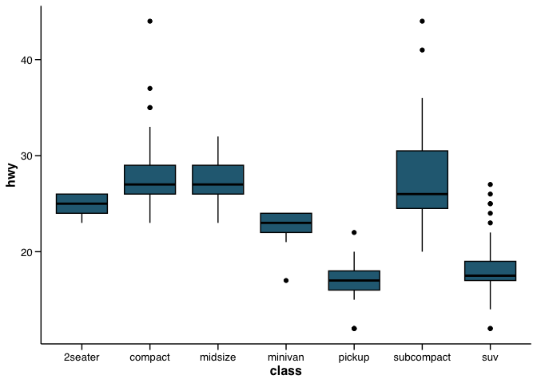
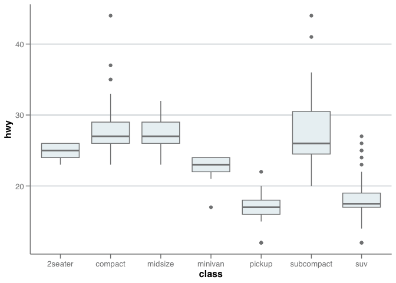
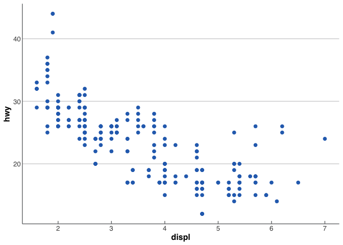

<!-- README.md is generated from README.Rmd. Please edit that file -->

# ggjournals

<!-- badges: start -->
<!-- badges: end -->

The `ggjournals` package provides custom ggplot2 themes and color
palettes for creating plots that adhere to the styles of various medical
journals, including BMJ, The Lancet, NEJM, and JAMA. This package also
incorporates the color palettes from the `ggsci` package, which provides
a collection of high-quality color palettes inspired by scientific
journals.

## Installation

You can install the package from GitHub using:

``` r
remotes::install_github("huichen99/ggjournals")
```

## Example

### Lancet Theme

Similarly, you can use the Lancet theme:

``` r
library(ggjournals)
library(ggplot2)

ggplot(mpg, aes(x = displ, y = hwy)) +
  geom_point() +
  theme_lancet()
```


### NEJM Theme

``` r
library(ggjournals)
library(ggplot2)

ggplot(mpg, aes(x = class, y = hwy)) +
  geom_boxplot() +
  theme_nejm()
```



### JAMA Theme

``` r
library(ggjournals)
library(ggplot2)

ggplot(mpg, aes(x = class, y = hwy)) +
  geom_boxplot() +
  theme_jama()
```



### BMJ Theme

To use the BMJ theme, simply add theme_bmj() to your ggplot2 plot:

``` r
library(ggjournals)
library(ggplot2)

ggplot(mpg, aes(x = displ, y = hwy)) +
  geom_point() +
  theme_bmj()
```



<!-- 
You'll still need to render `README.Rmd` regularly, to keep `README.md` up-to-date. `devtools::build_readme()` is handy for this. 
-->
